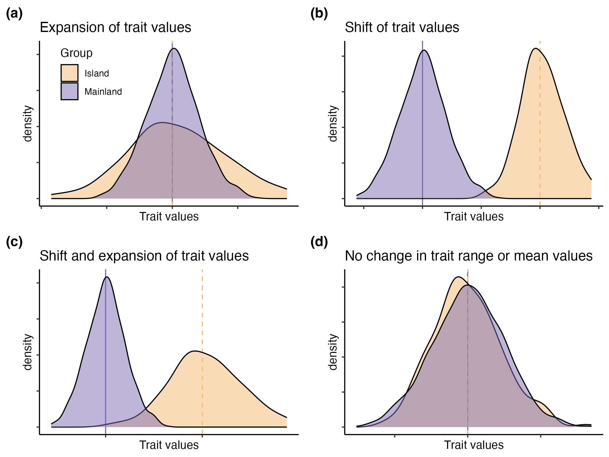
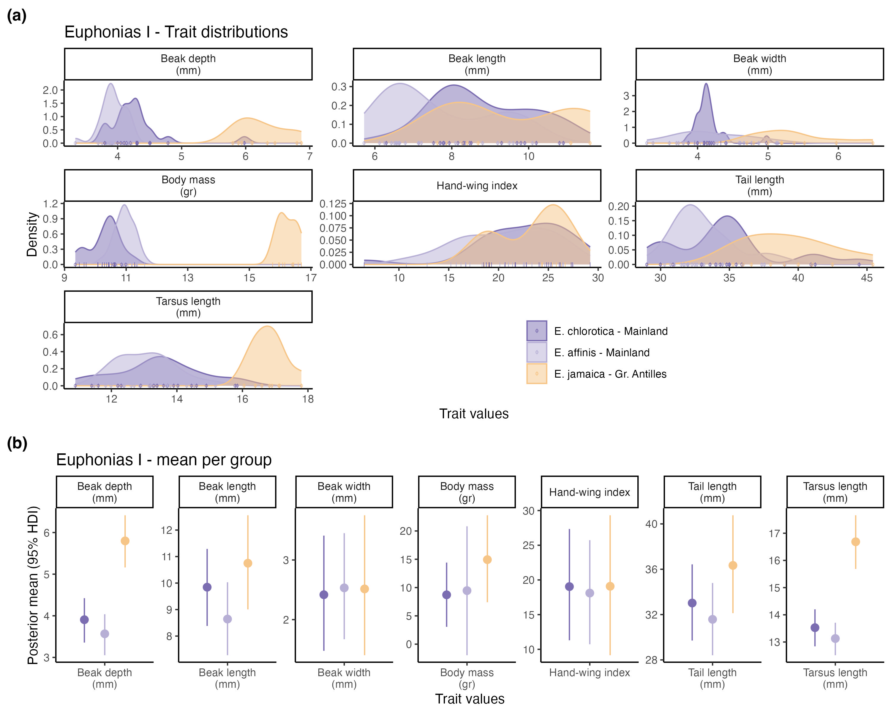
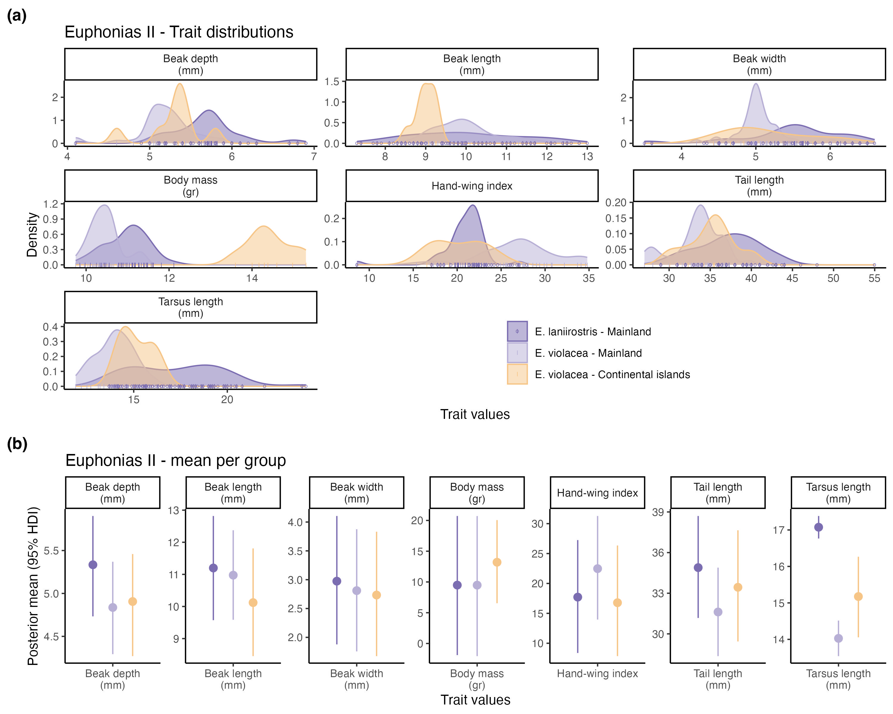
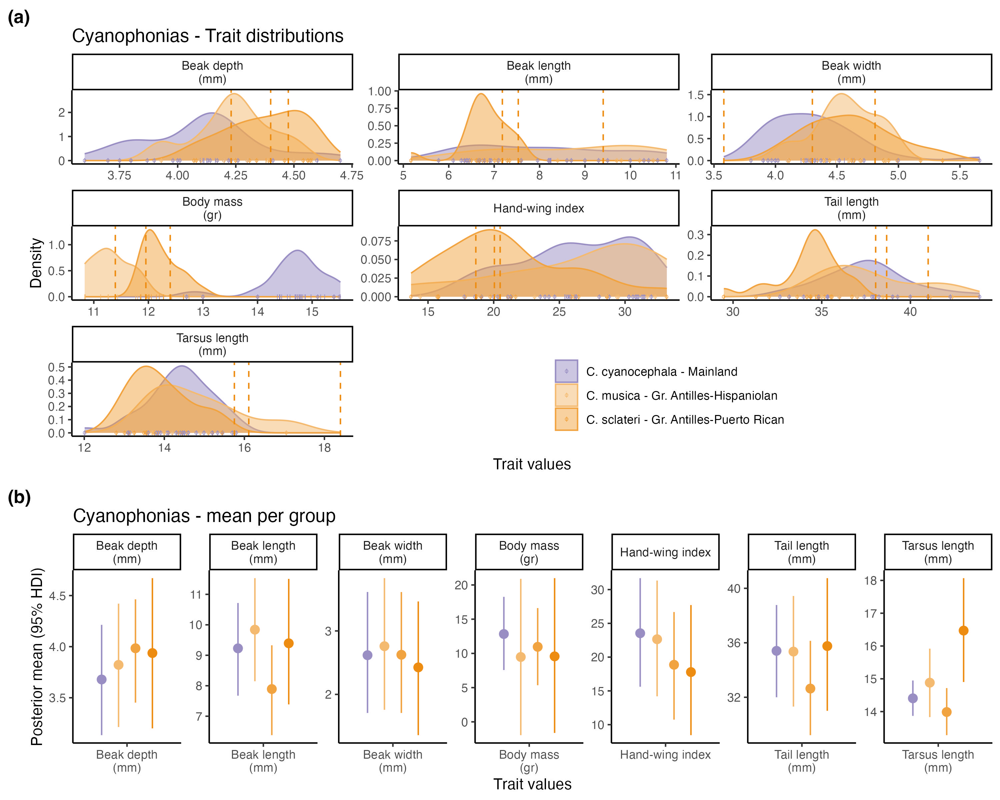
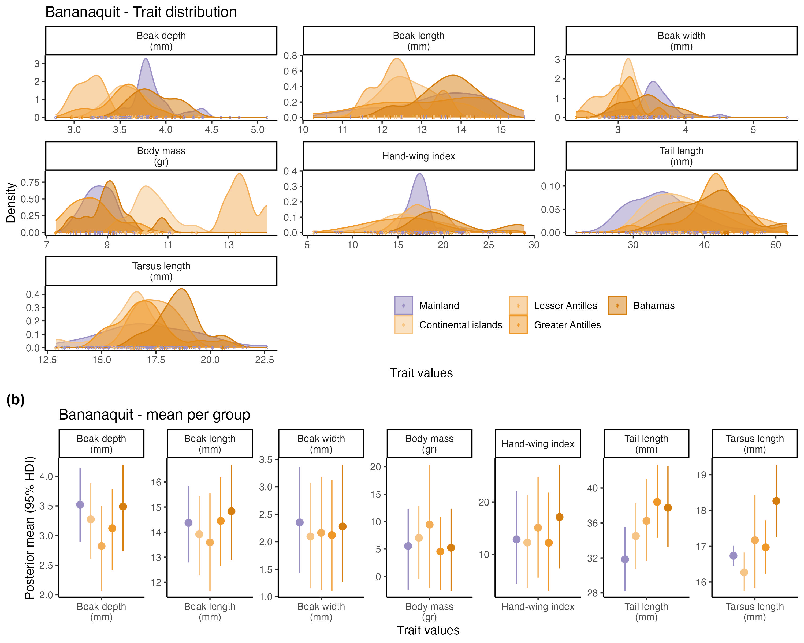

```{r setup, include=FALSE}
knitr::opts_chunk$set(echo = TRUE)
```

## Intro and packages

This code is part of the University Scholars Program by Mia Keriazes and Brynn M. Fricke, advised by Orlando Acevedo-Charry and his advisors: Miguel A. Acevedo and Scott K. Robinson. The project aimed to compare functional traits between species or group of species between mainland and islands populations. In islands, species face reduced interspecific competition and predation compared to their mainland counterparts. As a result, island populations may exhibit broader trait distributions, shifts in trait values, or both. The expected outcomes of ecological release can take different forms (Fig. 1): an expansion of trait values (Fig. 1a), a shift in trait values (Fig. 1b), both effects co-occurring (Fig. 1c), or no change if ecological release does not strongly influence trait evolution (Fig. 1d). Therefore, we hypothesize that island populations will show either greater variability in morphological traits or, if not in addition to, shifts in mean trait values due to ecological release in comparison to mainland populations.  


```{r call packages}
# data manipulation and visualization
library(tidyverse)

# correlation plot
library(corrplot)

# Functional diversity 
library(ggExtra) # for ggMarginal() of the density plot
library(gridExtra) #for grid.arrange()
library(ggrepel) # for geom_text_repel()

library(rjags) # impute
library(dclone) # impute
library(coda) # impute and model
library(HDInterval) #impute and model
library(nonpar) # comparison of variance with Miller Jackknife Procedure
```

```{r}
set.seed(123)

#Species from island and mainland - two traits shown
n_I <- 100
n_M <- 1000

Trait1_I <- rnorm(n = n_I, mean = 0, 1)
Trait2_I <- rnorm(n = n_I, mean = 0, 1)

Trait1_M <- rnorm(n = n_M, mean = 0, 1)
Trait2_M <- rnorm(n = n_M, mean = 0, 1)

data.Trait<- data.frame(Trait.Value = c(Trait1_I, Trait2_I,
                                        Trait1_M, Trait2_M),
                        Trait.Label = c(rep("Trait1",n_I),rep("Trait2",n_I),
                                        rep("Trait1",n_M),rep("Trait2",n_M)),
                        Group = c(rep("Island", (2*n_I)),
                                  rep("Mainland", (2*n_M))))

I_T1 <- data.Trait %>%
  filter(Group == "Island") %>%
  mutate(Trait.Value = Trait.Value*2,
         id = seq(1,n_I*2,1))

H1 <- data.Trait %>%
  filter(Group != "Island") %>%
  mutate(id = rep(seq(1,n_M,1),2)) %>% 
  full_join(I_T1)%>%
  pivot_wider(names_from = Trait.Label, values_from = Trait.Value)

A <- ggplot(H1, aes(x = Trait1, 
                    fill = Group))+
  geom_vline(xintercept = c(0,0), 
             linetype = c("solid", "dashed"), 
             color = c("#7b6db1","#f4ba70"))+
  geom_density(alpha = 0.5) +
  scale_fill_manual(values = c("#f4ba70", "#7b6db1"))+
  labs(title = "Expansion of trait values", 
       tag = expression(bold("(a)")),
       x = "Trait values")+
  theme_classic()+
  theme(legend.position = c(0.2,0.8),
        axis.text = element_blank())

I_T2 <- data.Trait %>%
  filter(Group == "Island") %>%
  filter(Trait.Label == "Trait1") %>%
  mutate(Trait.Value = Trait.Value+5,
         id = seq(1,n_I,1))

H2 <- data.Trait %>%
  filter(Group != "Island" | Trait.Label != "Trait1") %>%
  mutate(id = c(seq(1,n_I,1),rep(seq(1,n_M,1),2))) %>% 
  full_join(I_T2)%>%
  pivot_wider(names_from = Trait.Label, values_from = Trait.Value)

B <- ggplot(H2, aes(x = Trait1, fill = Group))+
  geom_vline(xintercept = c(0,5), linetype = c("solid", "dashed"), color = c("#7b6db1","#f4ba70"))+
  geom_density(alpha = 0.5) +
  scale_fill_manual(values = c("#f4ba70", "#7b6db1"))+
  labs(title = "Shift of trait values",
       tag = expression(bold("(b)")),
       x = "Trait values")+
  theme_classic()+
  theme(legend.position = "none",
        axis.text = element_blank())

I_T3 <- data.Trait %>%
  filter(Group == "Island") %>% 
  mutate(Trait.Value = (Trait.Value*2)+5,
         id = rep(seq(1,n_I,1),2))

H3 <- data.Trait %>%
  filter(Group != "Island") %>%
  mutate(id = rep(seq(1,n_M,1),2)) %>% 
  full_join(I_T3)%>%
  pivot_wider(names_from = Trait.Label, values_from = Trait.Value)

C <- ggplot(H3, aes(x = Trait1, fill = Group))+
  geom_vline(xintercept = c(0,5), linetype = c("solid", "dashed"), color = c("#7b6db1","#f4ba70"))+
  geom_density(alpha = 0.5) +
  scale_fill_manual(values = c("#f4ba70", "#7b6db1"))+
  labs(title = "Shift and expansion of trait values",
       tag = expression(bold("(c)")),
       x = "Trait values")+
  theme_classic()+
  theme(legend.position = "none",
        axis.text = element_blank())

D <- ggplot(data.Trait, aes(x = Trait.Value, fill = Group)) +
  geom_vline(xintercept = c(0,0), linetype = c("solid", "dashed"), color = c("#7b6db1","#f4ba70"))+
  geom_density(alpha = 0.5) +
  scale_fill_manual(values = c("#f4ba70", "#7b6db1"))+
  labs(title = "No change in trait range or mean values",
       tag = expression(bold("(d)")),
       x = "Trait values")+
  theme_classic()+
  theme(legend.position = "none",
        axis.text = element_blank())

#Combine
FigHypotheses <- grid.arrange(A, B, C, D, ncol = 2)

ggsave(FigHypotheses, filename = "Figure_Hypotheses.jpg", width = 8, height = 6)

```



## Calling data

### Measurements in the museum

```{r data measured}
data_specimens <- read_csv("flmnh_data/Museum Data Updated.csv") |>
  # new column with the species updated
  mutate(species_updated = paste(Genus, Species, sep = " "),
         # convert to number the mass
         body.mass = as.numeric(Mass),
         # correcting a typo
         species_updated = ifelse(species_updated == "Euphonia hirundinaceae",
                                  "Euphonia hirundinacea",species_updated),
         Sex = ifelse(Sex == "F", "F",
                      ifelse(Sex == "Female", "F",
                             ifelse(Sex == "M", "M",
                                    ifelse(Sex == "Male", "M",
                                           Sex))))) |>
   # filtering the species of interest
  filter(species_updated %in% c("Chlorophonia cyanocephala",
                                 "Chlorophonia elegantissima",
                                 "Chlorophonia flavifrons",
                                 "Chlorophonia musica",
                                 "Chlorophonia sclateri",
                                 "Euphonia affinis",
                                 "Euphonia chlorotica",
                                 "Euphonia jamaica",
                                 "Euphonia hirundinacea",
                                 "Euphonia laniirostris",
                                 "Euphonia violacea",
                                 "Coereba flaveola"))

species <- unique(data_specimens$species_updated) 
table(data_specimens$species_updated, data_specimens$Archipelago_group)
```

Given that some key species have few data (\textit{Chlorophonia musica}), we can extract the records from AVONET that have trackable location. 

### AVONET raw data

We use the raw data (`AVONET_Raw_Data` sheet in the Excel file) in AVONET ([Tobias et al. Ecol Letters 2022](https://onlinelibrary.wiley.com/doi/10.1111/ele.13898)). Unfortunately, raw data of AVONET does not include the variation of Body mass, they only included the mean value in their summary (`AVONET2_eBird` sheet in the Excel file).

```{r AVONET raw data}
avonet <- read_csv("FunctionalTraits/AVONET_Raw_Data.csv") |> 
  mutate(species_updated = ifelse(eBird.species.group == "Chlorophonia musica flavifrons",
                                  "Chlorophonia flavifrons",
                           ifelse(eBird.species.group == "Chlorophonia musica musica",
                                  "Chlorophonia musica",
                           ifelse(eBird.species.group == "Chlorophonia musica sclateri",
                                  "Chlorophonia sclateri",
                           Species2_eBird)))) |>
  dplyr::select(species_updated, Source, Specimen.number,
                Beak.Length_Culmen, Beak.Width, Beak.Depth,
                Tarsus.Length, `Hand-wing.Index`, Tail.Length) |>
  rename(HWI = `Hand-wing.Index`) |>
  filter(species_updated %in% species)

```
 
This raw data does not have Mass values, but we can impute this missing values under a Bayesian framework. 

Finally, we added the archipelago group (manually) to these specimens

```{r island or mainland for avonet}
avonet_islands <- read_csv("flmnh_data/AVONET_b_m_specimens_to_review.csv") |> 
  left_join(avonet) |>
  filter(species_updated %in% species) |>
  mutate(body.mass = NA)
```

And then combine the data
```{r generate unified traits data}
names(data_specimens)
names(avonet_islands)

traits_specimens <- data_specimens |> 
  dplyr::select(Archipelago_group, species_updated,
                body.mass, HWI, Tarsus.Length, Tail.Length, 
                Beak.Length_Culmen, Beak.Width, Beak.Depth)

traits_avonet <- avonet_islands |>
  dplyr::select(Archipelago_group,  species_updated,
                body.mass, HWI, Tarsus.Length, Tail.Length, 
                Beak.Length_Culmen, Beak.Width, Beak.Depth)

data_traits <- traits_specimens %>%
  rbind(traits_avonet) %>%
  group_by(species_updated)

colnames(data_traits) <- c("Archipelago", "Species",
                           "mass", "h.w.i", "tars.l", "tail.l",
                           "beak.l", "beak.w", "beak.d")

data_traits <- data_traits |>
  group_by(Species, Archipelago) |>
  dplyr::mutate(Sequence = row_number()) |>
  ungroup()

# a function for extract strings
id_specimen <- function(archipelago, species) {
    archipelago_part <- str_extract_all(archipelago, 
                                        "\\b\\w{2}") |>
      unlist() |>
      paste0(collapse = "")
    
    species_part <- str_extract_all(species, 
                                    "\\b\\w{3}") |>
      unlist() |>
      paste0(collapse = "")
    
    paste0(species_part, "_", archipelago_part)
}

data_traits <- data_traits |>
  mutate(Group = mapply(id_specimen, Archipelago, Species),
         ID = paste0(Group, "_", Sequence))

summary(data_traits)
```

There is a lot of missing data. We can check some allometric relationships to impute this missing data

```{r warning=FALSE}
names(data_traits)
GGally::ggpairs(data_traits |>
#                  filter(Species %in% c("Coereba flaveola")) |>
                  select(!c(ID, Sequence, Group, ID)), 
                aes(color = Archipelago), 
                alpha = 0.25)
```

Body mass (452 NAs) is highly correlated with Beak length (47 NAs; $\rho = 0.806$). The next higher correlation is between Beak depth and Beak width ($\rho = 0.750$), and then between Body mass and Beak width ($\rho = 0.718$). We can use these correlations, controlling by interaction of Archipelago group and species, to impute missing values.

## A Bayesian framework for imputation and test of posterior mean values per group

We assume that the data missing is at random because the probability to collect an individual does not depend on its trait measurements $T_i$ ([Kery & Royle, 2016](https://www-mbr--pwrc-usgs-gov.translate.goog/pubanalysis/keryroylebook/?_x_tr_sl=en&_x_tr_tl=es&_x_tr_hl=es&_x_tr_pto=tc)). Therefore, we model as latent variable the missing measurements in JAGS. 

For each individual, $i=1, ~...~, N$, the seven traits $\textbf{T}_i=(T_{1,i}, ~...~, T_{7,i})^⊤$ follow $T_{j,i} \sim \text{Normal}(\mu_{j,i}, \tau_j)$ with linear predictors $\mu_{j,i} = \beta_{j}+\beta_{1,j,g(i)}+ \sum_{m<j} \beta_{m→j}T_{m,i}$, where $j = 1, ~...~, 7$ indexes traits in the order $T_1$ is tarsus length (2% of missing values), $T_2$ is tail length (4% of missing values), $T_3$ is beak length (8.6% of missing values), $T_4$ is beak depth (23% of missing values), $T_5$ is hand-wing index (28% of missing values), $T_6$ is beak width (33% of missing values), and $T_7$ is body mass (82% of missing values). The species-archipelago group interaction index for each individual is $g(i)$, so $\beta_{1,j,g(i)}$ are the interaction-specific intercept deviation, while $\beta_{m→j}$ are regression coefficients linking earlier order traits $T_m$ to later order traits $T_j$.

But this model also allow to incorporate group-specific means (and variances) comparisons framed in our hypotheses (shift, expansion, both, none). The group-level mean is the first part of the linear predictor per trait $\mu_{T,g} = \beta_{0,T} + \beta_{1, T}g$. We can include a variance parameter per group, but this could overcomplicate this already heavy hierarchical model. Therefore, we use the variance per trait and will compare groups outside the Bayesian framework (with a Miller Jackknife Procedure `nonpar::miller.jack()`).

The model in JAGS language is:
```{r eval = TRUE}
Trait.model <- function(){
  # Likelihood
  for (i in 1:N) {
    # T_1 = Tarsus length
    tarsus[i] ~ dnorm(mu_tarsus[i], tau_tarsus)
    mu_tarsus[i] <- beta0_tarsus + 
                  beta1_tarsus[interaction_index[i]] 
    # T_2 = Tail length
    tail[i] ~ dnorm(mu_tail[i], tau_tail)
    mu_tail[i] <- beta0_tail + 
                  beta1_tail[interaction_index[i]] + 
                  beta2_tail * tarsus[i] 
    # T_3 = Beak length
    beakL[i] ~ dnorm(mu_beakL[i], tau_beakL)
    mu_beakL[i] <- beta0_beakL + 
                  beta1_beakL[interaction_index[i]] + 
                  beta2_beakL * tarsus[i] + 
                  beta3_beakL * tail[i] 
    # T_4 = Beak depth
    beakD[i] ~ dnorm(mu_beakD[i], tau_beakD)
    mu_beakD[i] <- beta0_beakD + 
                  beta1_beakD[interaction_index[i]] + 
                  beta2_beakD * tarsus[i] + 
                  beta3_beakD * tail[i] + 
                  beta4_beakD * beakL[i]
    # T_5 = HWI
    hwi[i] ~ dnorm(mu_hwi[i], tau_hwi)
    mu_hwi[i] <- beta0_hwi + 
                  beta1_hwi[interaction_index[i]] + 
                  beta2_hwi * tarsus[i] + 
                  beta3_hwi * tail[i] + 
                  beta4_hwi * beakL[i] + 
                  beta5_hwi * beakD[i]
    # T_6 = Beak width
    beakW[i] ~ dnorm(mu_beakW[i], tau_beakW)
    mu_beakW[i] <- beta0_beakW + 
                  beta1_beakW[interaction_index[i]] + 
                  beta2_beakW * tarsus[i] + 
                  beta3_beakW * tail[i] + 
                  beta4_beakW * beakL[i] + 
                  beta5_beakW * beakD[i] + 
                  beta6_beakW * hwi[i]
    # T_7 = body mass
    body[i] ~ dnorm(mu_body[i], tau_body)
    mu_body[i] <- beta0_body + 
                  beta1_body[interaction_index[i]] + 
                  beta2_body * tarsus[i] + 
                  beta3_body * tail[i] + 
                  beta4_body * beakL[i] + 
                  beta5_body * beakD[i] + 
                  beta6_body * hwi[i] + 
                  beta7_body * beakW[i]
  }
  
  # Group-level means (species × archipelago) for each trait 
  for (g in 1:(n_species * n_arc)) { 
    mu_group_tarsus[g] <- beta0_tarsus + beta1_tarsus[g] 
    mu_group_tail[g] <- beta0_tail + beta1_tail[g] 
    mu_group_beakL[g] <- beta0_beakL + beta1_beakL[g] 
    mu_group_beakD[g] <- beta0_beakD + beta1_beakD[g] 
    mu_group_hwi[g] <- beta0_hwi + beta1_hwi[g] 
    mu_group_beakW[g] <- beta0_beakW + beta1_beakW[g] 
    mu_group_body[g] <- beta0_body + beta1_body[g] 
  }
  
  # Priors for T_1 = tarsus
  beta0_tarsus ~ dnorm(0, 0.001)
  for (k in 1:(n_species * n_arc)) {
    beta1_tarsus[k] ~ dnorm(0, tau_interaction_tarsus)
  }
  tau_interaction_tarsus ~ dgamma(0.001, 0.001)
  tau_tarsus ~ dgamma(0.001, 0.001)
  
  # Priors for T_2 = tail
  beta0_tail ~ dnorm(0, 0.001)
  for (k in 1:(n_species * n_arc)) {
    beta1_tail[k] ~ dnorm(0, tau_interaction_tail)
  }
  tau_interaction_tail ~ dgamma(0.001, 0.001)
  beta2_tail ~ dnorm(0, 0.001)
  tau_tail ~ dgamma(0.001, 0.001)
  # Priors for T_3 = beakL
  beta0_beakL ~ dnorm(0, 0.001)
  for (k in 1:(n_species * n_arc)) {
    beta1_beakL[k] ~ dnorm(0, tau_interaction_beakL)
  }
  tau_interaction_beakL ~ dgamma(0.001, 0.001)
  beta2_beakL ~ dnorm(0, 0.001)
  beta3_beakL ~ dnorm(0, 0.001)
  tau_beakL ~ dgamma(0.001, 0.001)
  # Priors for T_4 = beakD
  beta0_beakD ~ dnorm(0, 0.001)
  for (k in 1:(n_species * n_arc)) {
    beta1_beakD[k] ~ dnorm(0, tau_interaction_beakD)
  }
  tau_interaction_beakD ~ dgamma(0.001, 0.001)
  beta2_beakD ~ dnorm(0, 0.001)
  beta3_beakD ~ dnorm(0, 0.001)
  beta4_beakD ~ dnorm(0, 0.001)
  tau_beakD ~ dgamma(0.001, 0.001)
  # Priors for T_5 = hwi
  beta0_hwi ~ dnorm(0, 0.001)
  for (k in 1:(n_species * n_arc)) {
    beta1_hwi[k] ~ dnorm(0, tau_interaction_hwi)
  }
  tau_interaction_hwi ~ dgamma(0.001, 0.001)
  beta2_hwi ~ dnorm(0, 0.001)
  beta3_hwi ~ dnorm(0, 0.001)
  beta4_hwi ~ dnorm(0, 0.001)
  beta5_hwi ~ dnorm(0, 0.001)
  tau_hwi ~ dgamma(0.001, 0.001)
  # Priors for T_6 = beakW
  beta0_beakW ~ dnorm(0, 0.001)
  for (k in 1:(n_species * n_arc)) {
    beta1_beakW[k] ~ dnorm(0, tau_interaction_beakW)
  }
  tau_interaction_beakW ~ dgamma(0.001, 0.001)
  beta2_beakW ~ dnorm(0, 0.001)
  beta3_beakW ~ dnorm(0, 0.001)
  beta4_beakW ~ dnorm(0, 0.001)
  beta5_beakW ~ dnorm(0, 0.001)
  beta6_beakW ~ dnorm(0, 0.001)
  tau_beakW ~ dgamma(0.001, 0.001)
  # Priors for T_7 = body
  beta0_body ~ dnorm(0, 0.001)
  for (k in 1:(n_species * n_arc)) {
    beta1_body[k] ~ dnorm(0, tau_interaction_body)
  }
  tau_interaction_body ~ dgamma(0.001, 0.001)
  beta2_body ~ dnorm(0, 0.001)
  beta3_body ~ dnorm(0, 0.001)
  beta4_body ~ dnorm(0, 0.001)
  beta5_body ~ dnorm(0, 0.001)
  beta6_body ~ dnorm(0, 0.001)
  beta7_body ~ dnorm(0, 0.001)
  tau_body ~ dgamma(0.001, 0.001)
}

```

We need to adjust the data for this model.

```{r eval = TRUE}
n_species <- length(unique(data_traits$Species))
n_arc <- length(unique(data_traits$Archipelago))

data_jags <- data_traits |> 
  dplyr::mutate(
    species = as.numeric(as.factor(Species)),
    arc = as.numeric(as.factor(Archipelago)),
    interaction_index = (species - 1) * n_arc + arc
  )

dat <- list(
  N = nrow(data_jags),
  tarsus = data_jags$tars.l,
  tail = data_jags$tail.l,
  beakL = data_jags$beak.l,
  beakD = data_jags$beak.d,
  hwi = data_jags$h.w.i,
  beakW = data_jags$beak.w,
  body = data_jags$mass,
  interaction_index = data_jags$interaction_index,
  n_species = n_species,
  n_arc = n_arc
)
```

To map the groups after modeling 
```{r}
groups_lookup <- data_jags |> 
  distinct(species, arc, interaction_index, Species, Archipelago) |>
  arrange(interaction_index)
print(groups_lookup)
```
- Note some combinations do not exist. For example, the species 1 _Chlorophonia cyanocephala_ is only distributed in Mainland, which is the archipelago 5, thus interaction index 1:4 is non-existent, and the unique interaction index is 5. On the other hand, _Coereba flaveola_ (the species 6) has 5 indexes (26:30), corresponding in order to Continental islands, Greater Antilles, Lesser Antilles - Kalinago, Lukayan, and the Mainland. This is not a problem from the model, but it should be taken carefully when interpreted the posterior distribution estimates.

We can fit the model

```{r eval = FALSE}
Trait.fit <- jags.fit(data = dat,
                       params = c("tarsus","tail",
                                  "beakL", "beakD",
                                  "hwi", "beakW",
                                  "body", 
                                  "mu_group_tarsus", "mu_group_tail", 
                                  "mu_group_beakL", "mu_group_beakD", 
                                  "mu_group_hwi", "mu_group_beakW", 
                                  "mu_group_body"),
                       model = Trait.model, 
                      n.adapt = 10000,
                      n.iter = 50000,
                      thin = 5)
saveRDS(Trait.fit, "flmnh_data/Trait_fit.RDS")
```

Extract posterior means of imputed values and add to original data to see the missing values

```{r eval = TRUE}
Trait.fit <- readRDS("flmnh_data/Trait_fit.RDS")
# Convert to matrix
mcmc_mat <- as.matrix(Trait.fit)

# Extract posterior means
tarsus_means <- colMeans(mcmc_mat[, grep("^tarsus\\[", colnames(mcmc_mat))])
tail_means <- colMeans(mcmc_mat[, grep("^tail\\[", colnames(mcmc_mat))])
beakL_means <- colMeans(mcmc_mat[, grep("^beakL\\[", colnames(mcmc_mat))])
beakD_means <- colMeans(mcmc_mat[, grep("^beakD\\[", colnames(mcmc_mat))])
hwi_means <- colMeans(mcmc_mat[, grep("^hwi\\[", colnames(mcmc_mat))])
beakW_means <- colMeans(mcmc_mat[, grep("^beakW\\[", colnames(mcmc_mat))])
body_means <- colMeans(mcmc_mat[, grep("^body\\[", colnames(mcmc_mat))])

# Add new columns with imputed values
data_traits$tarsus_imputed <- data_traits$tars.l
data_traits$tarsus_imputed[is.na(data_traits$tars.l)] <- tarsus_means[is.na(data_traits$tars.l)]

data_traits$tail_imputed <- data_traits$tail.l
data_traits$tail_imputed[is.na(data_traits$tail.l)] <- tail_means[is.na(data_traits$tail.l)]

data_traits$beakL_imputed <- data_traits$beak.l
data_traits$beakL_imputed[is.na(data_traits$beak.l)] <- beakL_means[is.na(data_traits$beak.l)]

data_traits$beakD_imputed <- data_traits$beak.d
data_traits$beakD_imputed[is.na(data_traits$beak.d)] <- beakD_means[is.na(data_traits$beak.d)]

data_traits$hwi_imputed <- data_traits$h.w.i
data_traits$hwi_imputed[is.na(data_traits$h.w.i)] <- hwi_means[is.na(data_traits$h.w.i)]

data_traits$beakW_imputed <- data_traits$beak.w
data_traits$beakW_imputed[is.na(data_traits$beak.w)] <- beakW_means[is.na(data_traits$beak.w)]

data_traits$bodyMass_imputed <- data_traits$mass
data_traits$bodyMass_imputed[is.na(data_traits$mass)] <- body_means[is.na(data_traits$mass)]

saveRDS(data_traits, 'flmnh_data/data_traits_imputed.rds')
```

Extract posterior means of the mean per group with 95% High Density Intervals 

```{r}
mu_params <- grep("mu_group_", colnames(mcmc_mat), value = TRUE)

extract_summary <- function(samples_vec) {
  list( 
    post_mean = mean(samples_vec), 
    hdi_lower = hdi(samples_vec, credMass = 0.95)[1], 
    hdi_upper = hdi(samples_vec, credMass = 0.95)[2] 
  ) 
}

summaries_mu <- lapply(mu_params, function(p) {
  extract_summary(mcmc_mat[, p]) 
  })

summary_df <- tibble( 
  mu_param = mu_params, 
  post_mean = map_dbl(summaries_mu, "post_mean"), 
  hdi_lower = map_dbl(summaries_mu, "hdi_lower"), 
  hdi_upper = map_dbl(summaries_mu, "hdi_upper") 
  ) 

summary_df$Trait <- gsub(".*_(.*)\\[.*", "\\1", summary_df$mu_param)

summary_df$interaction_index <- as.integer(gsub(".*\\[(.*)\\].*", "\\1", summary_df$mu_param))


posterior_traits <- groups_lookup |>
  left_join(summary_df, by = "interaction_index") |>
  mutate(Group = mapply(id_specimen, Archipelago, Species))

saveRDS(posterior_traits, "flmnh_data/Posterior_summaries.RDS")
```

## Comparisons of islands and the mainland populations

We can compare the difference of the posterior means (and 95%HDI) between groups for "shift hypothesis", while the Miller Jackknife Procedure `nonpar::miller.jack()` to compare variance

```{r}
posterior_traits <- readRDS("flmnh_data/Posterior_summaries.RDS")
posterior_traits

#example of a single trait and first comparison
nonpar::miller.jack(x = data_traits$bodyMass_imputed[data_traits$Group == "Eupaff_Ma"], 
                    y = data_traits$bodyMass_imputed[data_traits$Group == "Eupjam_GrAn"])

traits <- c( "bodyMass_imputed", "hwi_imputed", "tarsus_imputed", "tail_imputed", "beakL_imputed", "beakW_imputed", "beakD_imputed" )

contrasts <- tribble( 
  ~group_A, ~group_B, 
  "Eupaff_Ma", "Eupjam_GrAn", 
  "Eupchl_Ma", "Eupjam_GrAn", 
  "Eupvio_Ma", "Eupvio_Cois", 
  "Euplan_Ma", "Eupvio_Cois", 
  "Chlcya_Ma", "Chlmus_GrAn", 
  "Chlcya_Ma", "Chlscl_GrAn", 
  "Coefla_Ma", "Coefla_Cois", 
  "Coefla_Ma", "Coefla_GrAn", 
  "Coefla_Ma", "Coefla_LeAnKa", 
  "Coefla_Ma", "Coefla_Lu" 
  )

run_miller <- function(trait, group_A, group_B) { 
  x <- data_traits[[trait]][data_traits$Group == group_A] 
  y <- data_traits[[trait]][data_traits$Group == group_B] 
  out <- miller.jack(x, y) 
  tibble( 
    trait = trait, 
    group_A = group_A, 
    group_B = group_B, 
    statistic = out@TestStat, 
    p_value = out@PVal 
  ) 
}

results_miller <- contrasts |>
  mutate(results = pmap( 
    list(group_A, group_B), 
    function(a, b) { 
      map_df(traits, ~ run_miller(.x, a, b)) 
      } 
    )) |> unnest(results, names_sep = "_")

results_miller
```


We ordered in time calibrated history of Caribbean invasions and available phylogenies. First Euphonias I, with _Euphonia jamaica_ arriving around 3.5 Ma. Then, during the Pleistocene, around 1.18 Ma, Euphonias II include _Euphonia violacea_ in Trinidad and Tobago, but also diversification of Cyanophonias in the Lesser and Greater Antilles.

### Euphonias I
Euphonias I: _Euphonia chlorotica_ (M), _Euphonia affinis_ (M), _Euphonia jamaica_ (GA)

```{r}
data_traits <- readRDS('flmnh_data/data_traits_imputed.rds')

EuphoniaI <- data_traits |>
  filter(Species %in% c("Euphonia chlorotica",
                        "Euphonia affinis", 
                        "Euphonia jamaica")) |> 
  select(Archipelago, Species, Sequence, Group, ID,
         beakL_imputed, beakD_imputed, beakW_imputed,
         tarsus_imputed, hwi_imputed, tail_imputed,
         bodyMass_imputed)

EupIraw <- data_traits |>
  filter(Species %in% c("Euphonia chlorotica",
                        "Euphonia affinis", 
                        "Euphonia jamaica")) |> 
  select(Archipelago, Species, Sequence, Group, ID,
         beak.l, beak.d, beak.w,
         tars.l, h.w.i, tail.l,
         mass) |>
  pivot_longer(!c(Archipelago, Species, Sequence, Group, ID), 
               names_to = "trait", 
               values_to = "value") |>
  mutate(Group = factor(Group, 
                        levels = c("Eupchl_Ma",
                                   "Eupaff_Ma", 
                                   "Eupjam_GrAn")),
         Trait = ifelse(trait == "beak.d", "Beak depth\n(mm)",
                 ifelse(trait == "beak.l", "Beak length\n(mm)",
                 ifelse(trait == "beak.w", "Beak width\n(mm)",
                 ifelse(trait == "mass", "Body mass\n(gr)",
                 ifelse(trait == "h.w.i", "Hand-wing index",
                 ifelse(trait == "tail.l", "Tail length\n(mm)",
                 ifelse(trait == "tars.l", "Tarsus length\n(mm)",
                        trait)))))))) 
```

Figure in the text
```{r}
FigEuppIa <- EuphoniaI |>
  pivot_longer(!c(Archipelago, Species, Sequence, Group, ID), 
               names_to = "trait", 
               values_to = "value") |>
  mutate(Group = ifelse(Group == "Eupchl_Ma", "E. chlorotica - Mainland",
                 ifelse(Group == "Eupaff_Ma", "E. affinis - Mainland",
                 ifelse(Group == "Eupjam_GrAn", "E. jamaica - Gr. Antilles",
                        Group))),
         Group = factor(Group, 
                        levels = c("E. chlorotica - Mainland",
                                   "E. affinis - Mainland", 
                                   "E. jamaica - Gr. Antilles")),
         Trait = ifelse(trait == "beakD_imputed", "Beak depth\n(mm)",
                 ifelse(trait == "beakL_imputed", "Beak length\n(mm)",
                 ifelse(trait == "beakW_imputed", "Beak width\n(mm)",
                 ifelse(trait == "bodyMass_imputed", "Body mass\n(gr)",
                 ifelse(trait == "hwi_imputed", "Hand-wing index",
                 ifelse(trait == "tail_imputed", "Tail length\n(mm)",
                 ifelse(trait == "tarsus_imputed", "Tarsus length\n(mm)",
                        trait)))))))) |>
  ggplot(aes(x = value, fill = Group, color = Group)) +
  facet_wrap(~Trait, scales = "free") +
  geom_density(alpha = 0.5) +
  geom_point(aes(y = 0), shape = "I")+
  geom_point(data = EupIraw |>
               filter(Trait != "Hand-wing index") |>
               mutate(Group = ifelse(Group == "Eupchl_Ma", "E. chlorotica - Mainland",
                              ifelse(Group == "Eupaff_Ma", "E. affinis - Mainland",
                              ifelse(Group == "Eupjam_GrAn", "E. jamaica - Gr. Antilles",
                                Group))),
                      Group = factor(Group, 
                                     levels = c("E. chlorotica - Mainland",
                                                "E. affinis - Mainland", 
                                                "E. jamaica - Gr. Antilles"))), 
         aes(y = 0), shape = "o")+
  scale_fill_manual(values = c("#7b6db1", "#b7afd5", "#f6c587")) +
  scale_color_manual(values = c("#7b6db1", "#b7afd5", "#f6c587")) +
  labs(title = "Euphonias I - Trait distributions", 
       tag = expression(bold("(a)")),
       x = "Trait values", 
       y = "Density", 
       fill = "",
       color = "")+
  theme_classic()+
  theme(legend.position =  c(0.65,0.15))

FigEuppIb <- posterior_traits |>
  filter(Species %in% c("Euphonia chlorotica",
                        "Euphonia affinis", 
                        "Euphonia jamaica")) |>
  mutate(Group = ifelse(Group == "Eupchl_Ma", "E. chlorotica - Mainland",
                 ifelse(Group == "Eupaff_Ma", "E. affinis - Mainland",
                 ifelse(Group == "Eupjam_GrAn", "E. jamaica - Gr. Antilles",
                        Group))),
         Group = factor(Group, 
                        levels = c("E. chlorotica - Mainland",
                                   "E. affinis - Mainland", 
                                   "E. jamaica - Gr. Antilles")),
         Trait = ifelse(Trait == "beakD", "Beak depth\n(mm)",
                 ifelse(Trait == "beakL", "Beak length\n(mm)",
                 ifelse(Trait == "beakW", "Beak width\n(mm)",
                 ifelse(Trait == "body", "Body mass\n(gr)",
                 ifelse(Trait == "hwi", "Hand-wing index",
                 ifelse(Trait == "tail", "Tail length\n(mm)",
                 ifelse(Trait == "tarsus", "Tarsus length\n(mm)",
                        Trait)))))))) |>
  ggplot(aes(x = Trait, color = Group))+
    geom_pointrange(aes(y = post_mean, ymin = hdi_lower, ymax = hdi_upper),
                    position = position_dodge(width = 0.75))+
  facet_wrap(~Trait, scales = "free", nrow = 1)+
    scale_color_manual(values = c("#7b6db1", "#b7afd5", "#f6c587")) +
  labs(title = "Euphonias I - mean per group", 
       tag = expression(bold("(b)")),
       x = "Trait values", 
       y = "Posterior mean (95% HDI)", 
       fill = "",
       color = "")+
  theme_classic()+
  theme(legend.position =  "none")

FigEupI <- grid.arrange(FigEuppIa, FigEuppIb, ncol = 1, heights = c(1.5, 1))

ggsave(FigEupI, filename = "Figure_EuphoniaI.jpg", width = 10, height = 8)
```


### Euphonias II

Euphonia II: _Euphonia laniirostris_ (M), _Euphonia violacea_ (M), _Euphonia violacea_ (CI)

```{r}
table(data_traits$Group)
Euphlani <- data_traits |>
  filter(Species %in% c("Euphonia laniirostris")) |> 
  select(Archipelago, Species, Sequence, Group, ID,
         beakL_imputed, beakD_imputed, beakW_imputed,
         tarsus_imputed, hwi_imputed, tail_imputed,
         bodyMass_imputed) |>
  sample_n(41)

EuphoniaII <- data_traits |>
  filter(Species %in% c("Euphonia violacea")) |> 
  select(Archipelago, Species, Sequence, Group, ID,
         beakL_imputed, beakD_imputed, beakW_imputed,
         tarsus_imputed, hwi_imputed, tail_imputed,
         bodyMass_imputed) |>
  full_join(Euphlani)


EupIIraw <- data_traits |>
  filter(Species %in% c("Euphonia laniirostris", 
                        "Euphonia violacea")) |> 
  select(Archipelago, Species, Sequence, Group, ID,
         beak.l, beak.d, beak.w,
         tars.l, h.w.i, tail.l,
         mass) |>
  pivot_longer(!c(Archipelago, Species, Sequence, Group, ID), 
               names_to = "trait", 
               values_to = "value") |>
  mutate(Group = factor(Group, 
                        levels = c("Euplan_Ma", 
                                   "Eupvio_Ma",
                                   "Eupvio_Cois")),
         Trait = ifelse(trait == "beak.d", "Beak depth\n(mm)",
                 ifelse(trait == "beak.l", "Beak length\n(mm)",
                 ifelse(trait == "beak.w", "Beak width\n(mm)",
                 ifelse(trait == "mass", "Body mass\n(gr)",
                 ifelse(trait == "h.w.i", "Hand-wing index",
                 ifelse(trait == "tail.l", "Tail length\n(mm)",
                 ifelse(trait == "tars.l", "Tarsus length\n(mm)",
                        trait)))))))) 

```

Figure in the text
```{r}
FigEuppIIa <- EuphoniaII |>
  pivot_longer(!c(Archipelago, Species, Sequence, Group, ID), 
               names_to = "trait", 
               values_to = "value") |>
  mutate(Group = ifelse(Group == "Euplan_Ma", "E. laniirostris - Mainland",
                 ifelse(Group == "Eupvio_Ma", "E. violacea - Mainland",
                 ifelse(Group == "Eupvio_Cois", "E. violacea - Continental islands",
                        Group))),
         Group = factor(Group, 
                        levels = c("E. laniirostris - Mainland",
                                   "E. violacea - Mainland", 
                                   "E. violacea - Continental islands")),
         Trait = ifelse(trait == "beakD_imputed", "Beak depth\n(mm)",
                 ifelse(trait == "beakL_imputed", "Beak length\n(mm)",
                 ifelse(trait == "beakW_imputed", "Beak width\n(mm)",
                 ifelse(trait == "bodyMass_imputed", "Body mass\n(gr)",
                 ifelse(trait == "hwi_imputed", "Hand-wing index",
                 ifelse(trait == "tail_imputed", "Tail length\n(mm)",
                 ifelse(trait == "tarsus_imputed", "Tarsus length\n(mm)",
                        trait)))))))) |>
  ggplot(aes(x = value, fill = Group, color = Group)) +
  facet_wrap(~Trait, scales = "free") +
  geom_density(alpha = 0.5) +
  geom_point(aes(y = 0), shape = "I")+
  geom_point(data = EupIIraw |>
               mutate(Group = ifelse(Group == "Euplan_Ma", "E. laniirostris - Mainland",
                 ifelse(Group == "Eupviol_Ma", "E. violacea - Mainland",
                 ifelse(Group == "Eupviol_Cois", "E. violacea - Continental islands",
                        Group))),
         Group = factor(Group, 
                        levels = c("E. laniirostris - Mainland",
                                   "E. violacea - Mainland", 
                                   "E. violacea - Continental islands"))) |>
           drop_na(), 
         aes(y = 0), shape = "o")+
  scale_fill_manual(values = c("#7b6db1", "#b7afd5", "#f6c587")) +
  scale_color_manual(values = c("#7b6db1", "#b7afd5", "#f6c587")) +
  labs(title = "Euphonias II - Trait distributions", 
       tag = expression(bold("(a)")),
       x = "Trait values", 
       y = "Density", 
       fill = "",
       color = "")+
  theme_classic()+
  theme(legend.position =  c(0.65,0.15))

FigEuppIIb <- posterior_traits |>
  filter(Species %in% c("Euphonia laniirostris", 
                        "Euphonia violacea")) |>
  mutate(Group = ifelse(Group == "Euplan_Ma", "E. laniirostris - Mainland",
                 ifelse(Group == "Eupvio_Ma", "E. violacea - Mainland",
                 ifelse(Group == "Eupvio_Cois", "E. violacea - Continental islands",
                        Group))),
         Group = factor(Group, 
                        levels = c("E. laniirostris - Mainland",
                                   "E. violacea - Mainland", 
                                   "E. violacea - Continental islands")),
         Trait = ifelse(Trait == "beakD", "Beak depth\n(mm)",
                 ifelse(Trait == "beakL", "Beak length\n(mm)",
                 ifelse(Trait == "beakW", "Beak width\n(mm)",
                 ifelse(Trait == "body", "Body mass\n(gr)",
                 ifelse(Trait == "hwi", "Hand-wing index",
                 ifelse(Trait == "tail", "Tail length\n(mm)",
                 ifelse(Trait == "tarsus", "Tarsus length\n(mm)",
                        Trait)))))))) |>
  ggplot(aes(x = Trait, color = Group))+
    geom_pointrange(aes(y = post_mean, ymin = hdi_lower, ymax = hdi_upper),
                    position = position_dodge(width = 0.75))+
  facet_wrap(~Trait, scales = "free", nrow = 1)+
    scale_color_manual(values = c("#7b6db1", "#b7afd5", "#f6c587")) +
  labs(title = "Euphonias II - mean per group", 
       tag = expression(bold("(b)")),
       x = "Trait values", 
       y = "Posterior mean (95% HDI)", 
       fill = "",
       color = "")+
  theme_classic()+
  theme(legend.position =  "none")

FigEupII <- grid.arrange(FigEuppIIa, FigEuppIIb, ncol = 1, heights = c(1.5, 1))
ggsave(FigEupII, filename = "Figure_EuphoniaII.jpg", width = 10, height = 8)
```


### Cyanophonias
Cyanophonias: _Chlorophonia cyanocephala_ (M), _Chlorophonia musica_ (GA), _Chlorophonia sclateri_ (GA)

```{r}
Cyanophonias <- data_traits |>
  filter(Species %in% c("Chlorophonia cyanocephala", 
                        "Chlorophonia musica",
                        "Chlorophonia sclateri",
                        "Chlorophonia flavifrons")) |> 
  select(Archipelago, Species, Sequence, Group, ID,
         beakL_imputed, beakD_imputed, beakW_imputed,
         tarsus_imputed, hwi_imputed, tail_imputed,
         bodyMass_imputed)

Chlfla <- Cyanophonias |>
  pivot_longer(!c(Archipelago, Species, Sequence, Group, ID), 
               names_to = "trait", 
               values_to = "value") |>
  mutate(Group = factor(Group, 
                        levels = c("Chlcya_Ma", 
                                   "Chlscl_GrAn",
                                   "Chlmus_GrAn",
                                   "Chlfla_LeAnKa")),
         Trait = ifelse(trait == "beakD_imputed", "Beak depth\n(mm)",
                 ifelse(trait == "beakL_imputed", "Beak length\n(mm)",
                 ifelse(trait == "beakW_imputed", "Beak width\n(mm)",
                 ifelse(trait == "bodyMass_imputed", "Body mass\n(gr)",
                 ifelse(trait == "hwi_imputed", "Hand-wing index",
                 ifelse(trait == "tail_imputed", "Tail length\n(mm)",
                 ifelse(trait == "tarsus_imputed", "Tarsus length\n(mm)",
                        trait)))))))) |>
  filter(Group == "Chlfla_LeAnKa") 

Cyaraw <- data_traits |>
  filter(Species %in% c("Chlorophonia cyanocephala", 
                        "Chlorophonia musica",
                        "Chlorophonia sclateri")) |> 
  select(Archipelago, Species, Sequence, Group, ID,
         beak.l, beak.d, beak.w,
         tars.l, h.w.i, tail.l,
         mass) |>
  pivot_longer(!c(Archipelago, Species, Sequence, Group, ID), 
               names_to = "trait", 
               values_to = "value") |>
  mutate(Group = factor(Group, 
                        levels = c("Chlcya_Ma", 
                                   "Chlscl_GrAn",
                                   "Chlmus_GrAn")),
         Trait = ifelse(trait == "beak.d", "Beak depth\n(mm)",
                 ifelse(trait == "beak.l", "Beak length\n(mm)",
                 ifelse(trait == "beak.w", "Beak width\n(mm)",
                 ifelse(trait == "mass", "Body mass\n(gr)",
                 ifelse(trait == "h.w.i", "Hand-wing index",
                 ifelse(trait == "tail.l", "Tail length\n(mm)",
                 ifelse(trait == "tars.l", "Tarsus length\n(mm)",
                        trait)))))))) 

```

Clean figure
```{r}
FigCyana <- Cyanophonias |>
  pivot_longer(!c(Archipelago, Species, Sequence, Group, ID), 
               names_to = "trait", 
               values_to = "value") |>
  mutate(Group = ifelse(Group == "Chlcya_Ma", "C. cyanocephala - Mainland",
                 ifelse(Group == "Chlscl_GrAn", "C. sclateri - Gr. Antilles-Puerto Rican",
                 ifelse(Group == "Chlmus_GrAn", "C. musica - Gr. Antilles-Hispaniolan",
                        Group))),
         Group = factor(Group, 
                        levels = c("C. cyanocephala - Mainland", 
                                   "C. musica - Gr. Antilles-Hispaniolan",
                                   "C. sclateri - Gr. Antilles-Puerto Rican",
                                   "Chlfla_LeAnKa")),
         Trait = ifelse(trait == "beakD_imputed", "Beak depth\n(mm)",
                 ifelse(trait == "beakL_imputed", "Beak length\n(mm)",
                 ifelse(trait == "beakW_imputed", "Beak width\n(mm)",
                 ifelse(trait == "bodyMass_imputed", "Body mass\n(gr)",
                 ifelse(trait == "hwi_imputed", "Hand-wing index",
                 ifelse(trait == "tail_imputed", "Tail length\n(mm)",
                 ifelse(trait == "tarsus_imputed", "Tarsus length\n(mm)",
                        trait)))))))) |>
  filter(Group != "Chlfla_LeAnKa") |>
  ggplot(aes(x = value, fill = Group, color = Group)) +
  facet_wrap(~Trait, scales = "free") +
  geom_density(alpha = 0.5) +
  geom_point(aes(y = 0), shape = "I")+
  geom_point(data = Cyaraw |>
               mutate(Group = ifelse(Group == "Chlcya_Ma", "C. cyanocephala - Mainland",
                              ifelse(Group == "Chlscl_GrAn", "C. sclateri - Gr. Antilles-Puerto Rican",
                              ifelse(Group == "Chlmus_GrAn", "C. musica - Gr. Antilles-Hispaniolan",
                                Group))),
                      Group = factor(Group, 
                                     levels = c("C. cyanocephala - Mainland",
                                   "C. musica - Gr. Antilles-Hispaniolan", 
                                   "C. sclateri - Gr. Antilles-Puerto Rican"))), 
         aes(y = 0), shape = "o")+
  geom_vline(data = Chlfla, aes(xintercept = value), 
             linetype = "dashed", color = "#ed8c11") +
  scale_fill_manual(values = c("#998ec3","#f4ba70", "#f1a340")) +
  scale_color_manual(values = c("#998ec3","#f4ba70", "#f1a340")) +
  labs(title = "Cyanophonias - Trait distributions", 
       tag = expression(bold("(a)")),
       x = "Trait values", 
       y = "Density", 
       fill = "",
       color = "")+
  theme_classic()+
  theme(legend.position =  c(0.65,0.15))

FigCyanb <- posterior_traits |>
  filter(Species %in% c("Chlorophonia cyanocephala", 
                        "Chlorophonia musica",
                        "Chlorophonia sclateri",
                        "Chlorophonia flavifrons")) |>
  mutate(Group = ifelse(Group == "Chlcya_Ma", "C. cyanocephala - Mainland",
                              ifelse(Group == "Chlscl_GrAn", "C. sclateri - Gr. Antilles-Puerto Rican",
                              ifelse(Group == "Chlmus_GrAn", "C. musica - Gr. Antilles-Hispaniolan",
                                Group))),
                      Group = factor(Group, 
                                     levels = c("C. cyanocephala - Mainland",
                                   "C. musica - Gr. Antilles-Hispaniolan", 
                                   "C. sclateri - Gr. Antilles-Puerto Rican",
                                   "Chlfla_LeAnKa")),
         Trait = ifelse(Trait == "beakD", "Beak depth\n(mm)",
                 ifelse(Trait == "beakL", "Beak length\n(mm)",
                 ifelse(Trait == "beakW", "Beak width\n(mm)",
                 ifelse(Trait == "body", "Body mass\n(gr)",
                 ifelse(Trait == "hwi", "Hand-wing index",
                 ifelse(Trait == "tail", "Tail length\n(mm)",
                 ifelse(Trait == "tarsus", "Tarsus length\n(mm)",
                        Trait)))))))) |>
  ggplot(aes(x = Trait, color = Group))+
    geom_pointrange(aes(y = post_mean, ymin = hdi_lower, ymax = hdi_upper),
                    position = position_dodge(width = 0.75))+
  facet_wrap(~Trait, scales = "free", nrow = 1)+
    scale_color_manual(values = c("#998ec3","#f4ba70", "#f1a340", "#ed8c11")) +
  labs(title = "Cyanophonias - mean per group", 
       tag = expression(bold("(b)")),
       x = "Trait values", 
       y = "Posterior mean (95% HDI)", 
       fill = "",
       color = "")+
  theme_classic()+
  theme(legend.position =  "none")

FigCyan <- grid.arrange(FigCyana, FigCyanb, ncol = 1, heights = c(1.5, 1))

ggsave(FigCyan, filename = "Figure_Cyanophonias.jpg", width = 10, height = 8)
```


### Bananaquits - reverse colonization
Bananaquits: _Chlorophonia cyanocephala_ (M), _Chlorophonia musica_ (GA), _Chlorophonia sclateri_ (GA)

```{r}
bananasM <- data_traits |>
  filter(Species %in% c("Coereba flaveola"), 
         Archipelago == "Mainland") |> 
  select(Archipelago, Species, Sequence, Group, ID,
         beakL_imputed, beakD_imputed, beakW_imputed,
         tarsus_imputed, hwi_imputed, tail_imputed,
         bodyMass_imputed) |>
  sample_n(33, replace = FALSE)

bananas <- data_traits |>
  filter(Species %in% c("Coereba flaveola"), 
         Archipelago != "Mainland") |> 
  select(Archipelago, Species, Sequence, Group, ID,
         beakL_imputed, beakD_imputed, beakW_imputed,
         tarsus_imputed, hwi_imputed, tail_imputed,
         bodyMass_imputed) |>
  full_join(bananasM)

Bananaraw <- data_traits |>
  filter(Species %in% c("Coereba flaveola")) |> 
  select(Archipelago, Species, Sequence, Group, ID,
         beak.l, beak.d, beak.w,
         tars.l, h.w.i, tail.l,
         mass) |>
  pivot_longer(!c(Archipelago, Species, Sequence, Group, ID), 
               names_to = "trait", 
               values_to = "value") |>
  mutate(Group = factor(Group, 
                        levels = c("Coefla_Ma", 
                                   "Coefla_Cois",
                                   "Coefla_LeAnKa",
                                   "Coefla_GrAn",
                                   "Coefla_Lu")),
         Trait = ifelse(trait == "beak.d", "Beak depth\n(mm)",
                 ifelse(trait == "beak.l", "Beak length\n(mm)",
                 ifelse(trait == "beak.w", "Beak width\n(mm)",
                 ifelse(trait == "mass", "Body mass\n(gr)",
                 ifelse(trait == "h.w.i", "Hand-wing index",
                 ifelse(trait == "tail.l", "Tail length\n(mm)",
                 ifelse(trait == "tars.l", "Tarsus length\n(mm)",
                        trait)))))))) 

```

Figure in the text 
```{r}
FigCoeflaa <- bananas |>
  pivot_longer(!c(Archipelago, Species, Sequence, Group, ID), 
               names_to = "trait", 
               values_to = "value") |>
  mutate(Group = ifelse(Group == "Coefla_Ma", "Mainland",
                 ifelse(Group == "Coefla_Cois", "Continental islands",
                 ifelse(Group == "Coefla_LeAnKa", "Lesser Antilles",
                 ifelse(Group == "Coefla_GrAn", "Greater Antilles",
                 ifelse(Group == "Coefla_Lu", "Bahamas",
                 Group))))),
                 Group = factor(Group, 
                        levels = c("Mainland", 
                                   "Continental islands",
                                   "Lesser Antilles",
                                   "Greater Antilles",
                                   "Bahamas")),
         Trait = ifelse(trait == "beakD_imputed", "Beak depth\n(mm)",
                 ifelse(trait == "beakL_imputed", "Beak length\n(mm)",
                 ifelse(trait == "beakW_imputed", "Beak width\n(mm)",
                 ifelse(trait == "bodyMass_imputed", "Body mass\n(gr)",
                 ifelse(trait == "hwi_imputed", "Hand-wing index",
                 ifelse(trait == "tail_imputed", "Tail length\n(mm)",
                 ifelse(trait == "tarsus_imputed", "Tarsus length\n(mm)",
                        trait)))))))) |>
  ggplot(aes(x = value, fill = Group, color = Group)) +
  facet_wrap(~Trait, scales = "free") +
  geom_density(alpha = 0.5) +
  geom_point(aes(y = 0), shape = "I")+
  geom_point(data = Bananaraw |>
               mutate(Group = ifelse(Group == "Coefla_Ma", "Mainland",
                 ifelse(Group == "Coefla_Cois", "Continental islands",
                 ifelse(Group == "Coefla_LeAnKa", "Lesser Antilles",
                 ifelse(Group == "Coefla_GrAn", "Greater Antilles",
                 ifelse(Group == "Coefla_Lu", "Bahamas",
                 Group))))),
                 Group = factor(Group, 
                        levels = c("Mainland", 
                                   "Continental islands",
                                   "Lesser Antilles",
                                   "Greater Antilles",
                                   "Bahamas"))) |>
               filter(Trait != "Beak length\n(mm)"), 
         aes(y = 0), shape = "o")+
  scale_fill_manual(values = c("#998ec3", "#f6c587","#f3ae58", "#ef9828", "#d57e10")) +
  scale_color_manual(values = c("#998ec3", "#f6c587","#f3ae58", "#ef9828", "#d57e10")) +
  labs(title = "Bananaquit - Trait distribution", 
       x = "Trait values", 
       y = "Density", 
       fill = "",
       color = "")+
  theme_classic()+
  theme(legend.position =  c(0.65,0.15))+
  guides(color = guide_legend(nrow = 2),
         fill = guide_legend(nrow = 2))

FigCoeflab <- posterior_traits |>
  filter(Species %in% c("Coereba flaveola")) |>
  mutate(Group = ifelse(Group == "Coefla_Ma", "Mainland",
                 ifelse(Group == "Coefla_Cois", "Continental islands",
                 ifelse(Group == "Coefla_LeAnKa", "Lesser Antilles",
                 ifelse(Group == "Coefla_GrAn", "Greater Antilles",
                 ifelse(Group == "Coefla_Lu", "Bahamas",
                 Group))))),
                 Group = factor(Group, 
                        levels = c("Mainland", 
                                   "Continental islands",
                                   "Lesser Antilles",
                                   "Greater Antilles",
                                   "Bahamas")),
         Trait = ifelse(Trait == "beakD", "Beak depth\n(mm)",
                 ifelse(Trait == "beakL", "Beak length\n(mm)",
                 ifelse(Trait == "beakW", "Beak width\n(mm)",
                 ifelse(Trait == "body", "Body mass\n(gr)",
                 ifelse(Trait == "hwi", "Hand-wing index",
                 ifelse(Trait == "tail", "Tail length\n(mm)",
                 ifelse(Trait == "tarsus", "Tarsus length\n(mm)",
                        Trait)))))))) |>
  ggplot(aes(x = Trait, color = Group))+
    geom_pointrange(aes(y = post_mean, ymin = hdi_lower, ymax = hdi_upper),
                    position = position_dodge(width = 0.75))+
  facet_wrap(~Trait, scales = "free", nrow = 1)+
    scale_color_manual(values = c("#998ec3", "#f6c587","#f3ae58", "#ef9828", "#d57e10")) +
  labs(title = "Bananaquit - mean per group", 
       tag = expression(bold("(b)")),
       x = "Trait values", 
       y = "Posterior mean (95% HDI)", 
       fill = "",
       color = "")+
  theme_classic()+
  theme(legend.position =  "none")

FigBanana <- grid.arrange(FigCoeflaa, FigCoeflab, ncol = 1, heights = c(1.5, 1))
ggsave(FigBanana, filename = "Figure_Bananaquit.jpg", width = 10, height = 8)
```



